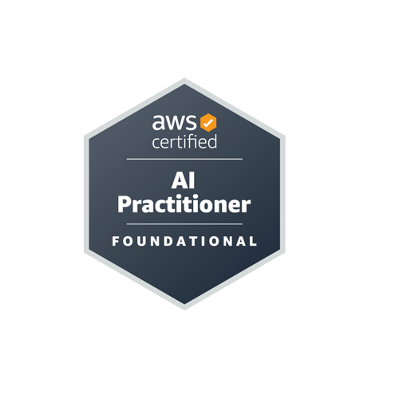

# AWS Certified AI Practitioner Note  Study Notes



This repository contains comprehensive study materials for the AWS Certified AI Practitioner exam.

## Learning  Outline

1. [Introduction to Artificial Intelligence](./notes/01-introduction-to-ai/01-introduction-to-ai.md)
2. [Introduction to Cloud Computing](./notes/02-introduction-to-cloud-computing/02-introduction-to-cloud-computing.md)
3. [Amazon Bedrock and Generative AI (GenAI)](./notes/03-amazon-bedrock-genai/03-amazon-bedrock-genai.md)
4. [Prompt Engineering](./notes/04-prompt-engineering/04-prompt-engineering.md)
5. [Amazon Q Deep Dive](./notes/05-amazon-q-deep-dive/05-amazon-q-deep-dive.md)
6. [Artificial Intelligence (AI) & Machine Learning (ML)](./notes/06-ai-ml-fundamentals.md)
7. [AWS Managed AI Services](./notes/07-aws-managed-ai-services/07-aws-managed-ai-services.md)
8. [Amazon SageMaker - Deep Dive](./notes/08-amazon-sagemaker-deep-dive/08-amazon-sagemaker-deep-dive.md)
9. [AI Challenges and Responsibilities](./notes/09-ai-challenges-responsibilities.md)
10. [AWS Security Services & More](./notes/10-aws-security-services/10-aws-security-services.md)

##  Repository Structure

```
aws-cloud-practitioner-notes/
├── README.md
├── images/                 # Diagrams, screenshots, and visual aids
├── notes/                  # Detailed study notes for each topic
└── resources/             # Additional resources and references
```


##  Learning Resources

- [Udemy - Ultimate AWS Certified AI Practitioner AIF-C01 ](https://www.udemy.com/course/aws-ai-practitioner-certified/?couponCode=KEEPLEARNING)