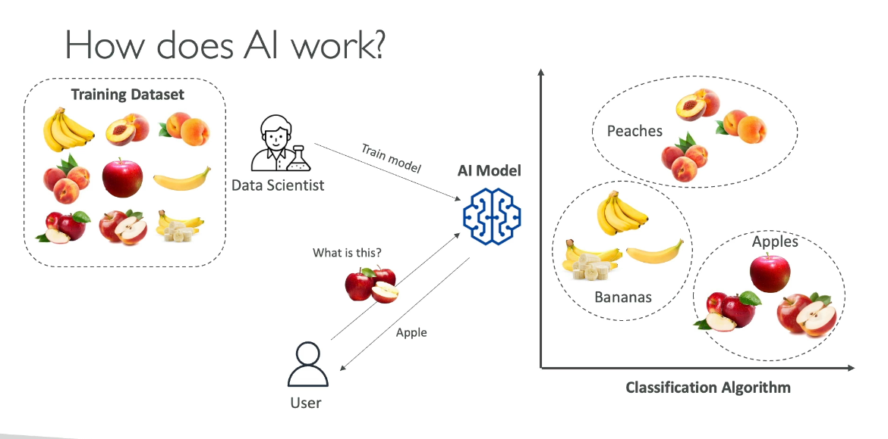

# Introduction to Artificial Intelligence


## What is Artificial Intelligence?
Artificial intelligence is a field of computer science dedicated to solving problems that we commonly associate with human intelligence.

### How Does AI Work 
``` Training Dataset ==> Data Scientist Train Model ==> AI MODEL ```



### Example 0.1: IDP Intelligent Document Processing
In this case, we have a PDF invoice file that was generated from an image.


Now the AI Model above leverages the below technologies 
- COMPUTER VISION: This is used to see the image and interpret it
- DEEP LEARNING:  This is to understand how they work from an image perspective.
- NATURAL LANGUAGE PROCESSING: ```NLP``` This enables us to comprehend 
the meaning of everything before we can or can extract it accurately.

### Artificial Intelligence Today 
    Artificial Intelligence
- Machine Learning: This is when the model is being Trained with Data 
- Deep Learning: Neural Network 
- Generative AI  ChatGPT, Dall-E, Deepseek r1
- Introduction to Artificial Intelligence


### SUMMARY 
Artificial intelligence is a field of computer science that solves problems associated with human intelligence.  AI models are trained using datasets and leverage technologies like computer vision,  deep learning, and natural language processing.


[← Previous](../../README.md) | [Next: Introduction to Cloud Computing →](../02-introduction-to-cloud-computing/02-introduction-to-cloud-computing.md)
