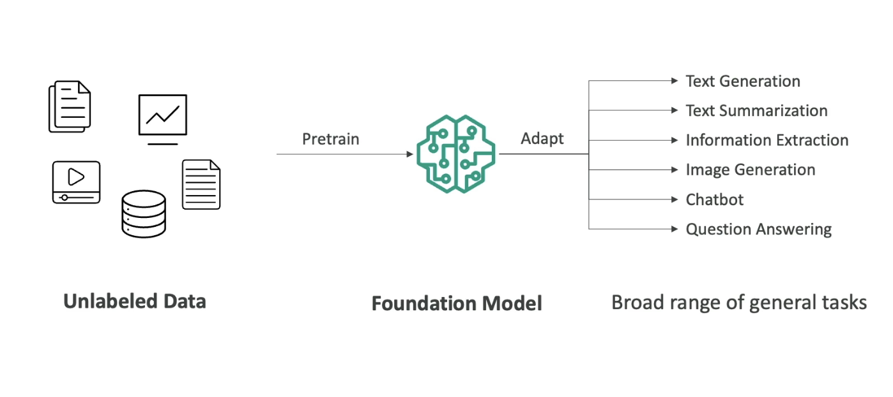

# Amazon Bedrock and Generative AI (GenAI)

## Overview
Amazon Bedrock is a fully managed AWS service that allows you to build and scale Generative AI (GenAI) applications without managing servers or infrastructure.  

---

## What is Generative AI?
- A subset of Deep Learning focused on generating new content.
- Can produce:
  - Text
  - Images
  - Audio
  - Code
  - Video
- Trained on large datasets (e.g., images of dogs, cartoons, documents).

Below is unlabelled data that is pre-train on a Foundation Model that can adapt and use the training data to generate a Broad range of general tasks

---

## Foundation Models
- Core models trained on a wide variety of input data.
- Expensive to build (tens of millions of dollars).
- Examples:
  - OpenAI GPT-4o
  - Meta (LLaMA)
  - Amazon
  - Google
  - Anthropic
- Some open-source options: Google BERT, Meta models, DeepSeek R1.

---

## Large Language Models (LLM)
- Specialized foundation models designed to generate coherent, human-like text.
- Examples: Google, Anthropic.

---

## Amazon Bedrock
- Build GenAI apps on AWS using managed services.
- No server management required.
- **Your data is never used to train foundation models.**

### Supported Foundation Models
- AI21 Labs
- Cohere
- Stability.ai
- Amazon
- Anthropic
- Meta
- Mistral AI

### Amazon Titans
- AWS-native foundation models.
- Support text, image, and multimodal tasks.
- Customizable with your own data.

---

## RAG (Retrieval Augmented Generation) in Bedrock
- Allows models to pull from external data sources beyond training data.
- Bedrock handles vector embeddings automatically.
- Useful for real-time or domain-specific queries.

### Vector Database Options
- Amazon OpenSearch Service (search & analytics)
- Amazon DocumentDB (NoSQL)
- Amazon Aurora (Relational DB)
- Amazon RDS for PostgreSQL
- Amazon Neptune (Graph DB)

### Use Cases
- **Customer Service Chatbots**: FAQs, troubleshooting.
- **Legal Research**: Regulations, case precedents.
- **Healthcare Q&A**: Treatments, guidelines, medical queries.

---
[← Previous: Introduction to Cloud Computing](./01-introduction-to-ai.md) | [Next: Amazon Bedrock and GenAI →](../03-amazon-bedrock-genai/03-amazon-bedrock-genai.md)
